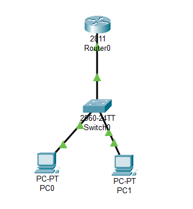

# Lab 1 – Inter-VLAN Routing (Router-on-a-Stick)

## 🎯 Цель
Разделить сеть на VLAN и обеспечить маршрутизацию между ними через Router-on-a-Stick.

## 🖥️ Топология
- Router: Cisco 2811
- Switch: Cisco 2960
- PC0 → VLAN 10 (Sales)
- PC1 → VLAN 20 (IT)

## 🌐 Адресация
- VLAN 10: 192.168.10.0/24  
  - PC0: 192.168.10.2 / 24, GW: 192.168.10.1
- VLAN 20: 192.168.20.0/24  
  - PC1: 192.168.20.2 / 24, GW: 192.168.20.1

## ⚙️ Конфигурация

### Switch (2960)
  bash
vlan 10
 name Sales
vlan 20
 name IT

interface fa0/1
 switchport mode access
 switchport access vlan 10

interface fa0/2
 switchport mode access
 switchport access vlan 20

interface fa0/24
 switchport mode trunk

### Router (2960)
interface fa0/0.10
 encapsulation dot1Q 10
 ip address 192.168.10.1 255.255.255.0
!
interface fa0/0.20
 encapsulation dot1Q 20
 ip address 192.168.20.1 255.255.255.0
!
interface fa0/0
 no shutdown
